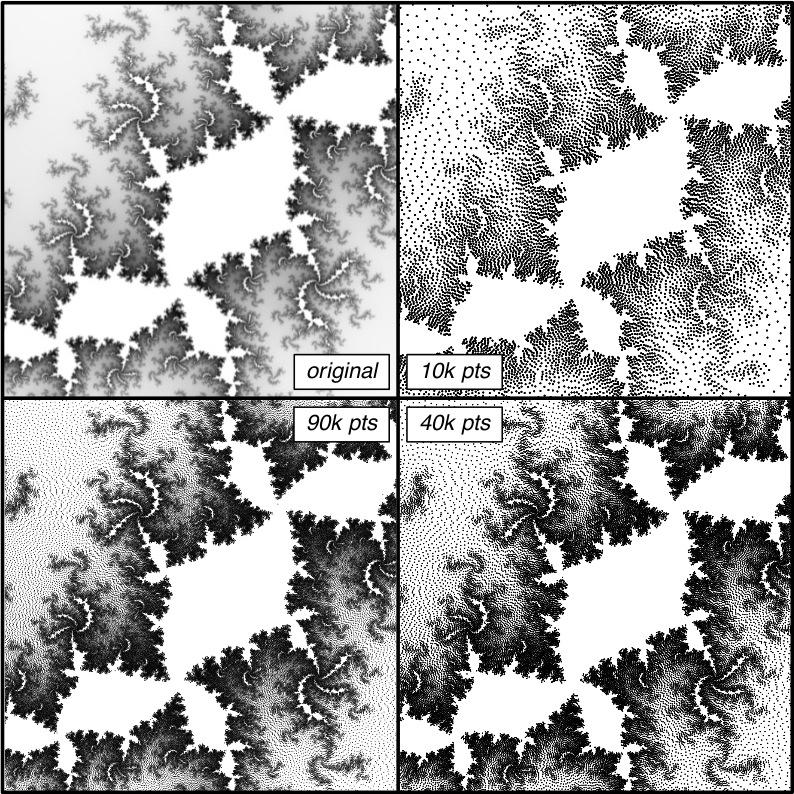

# Monge: Optimal Transport Toolkit for Model Calibration
It is very common that we face iliquidity positions when infering default probability, calibrating stochastic models or building volatifiy surface, which means we need find a way to fill the gaps in the sparse market data. This library a lightweight implementation of "Instant Transport Maps on 2D Grids" to help us handle the iliquidity problems during model calibration.

It currently supports L2-optimal maps from an arbitrary density defined on a uniform 2D grid to a square with uniform density.
Inverse maps and maps between pairs of arbitrary images are then recovered through numerical inversion.

## Installation

This code uses Eigen and Surface_mesh,  that are already included in the repo/archive. It is recommended to install SuiteSparse/Cholmod for high performance.

To install this library, please follow below instructions.

````
$ git clone https://github.com/jialuechen/monge.git
$ cd monge
$ mkdir build
$ cd build
$ cmake ..
$ make -j 8
````

## Examples

#### sampling
<div align=center>

</div>

